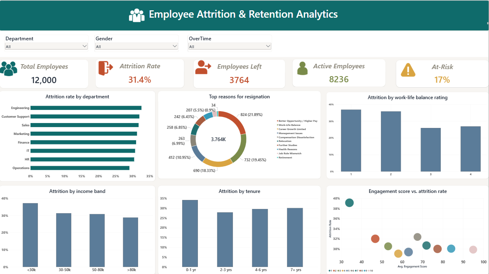

# Employee Attrition & Retention Analytics Dashboard

Power BI dashboard analyzing employee attrition across 12,000 records — attrition rate, resignation reasons, and at-risk segments by department, income, tenure, and engagement.

## 📌 Problem Statement

HR teams often struggle to understand why employees resign because exit reasons, attendance records, performance reviews, and engagement data live in separate systems, making it hard to spot patterns. This dashboard brings those data points into a single view so HR can:

- Identify departments with high attrition
- Analyze common resignation reasons
- Spot employees at risk of leaving
- Take proactive, data-backed retention measures

## 📊 Dashboard Overview

**KPI Cards:** Total Employees, Attrition Rate, Employees Left, Active Employees, At-Risk %

**Visuals:**
- Attrition rate by department
- Top reasons for resignation (donut chart)
- Attrition by work-life balance rating
- Attrition by income band
- Attrition by tenure
- Engagement score vs. attrition rate (scatter plot)

**Interactivity:** Slicers for Department, Gender, and OverTime let users filter the entire dashboard to a specific employee segment.

## 🔑 Key Insights

- Overall attrition rate stands at **31.4%**, with **3,764** employees having left.
- **Better Opportunity/Higher Pay** (21.9%) and **Work-Life Balance** (19.5%) are the top two resignation reasons, followed by **Career Growth Limited** (18.3%).
- Attrition is highest among employees with **poor work-life balance ratings** and in their **first year of tenure**.
- Lower **engagement scores** correlate with higher attrition rates, offering an early-warning signal for at-risk employees.

## 🗂️ Repository Contents

| File | Description |
|---|---|
| `hr_attrition.pbix` | Power BI dashboard file |
| `hr_attrition_dataset.csv` | Source dataset (12,000 employee records, synthetically generated) |
| `hr_dashboard.png` | Dashboard screenshot |
| `LICENSE` | Repository license |

## 🛠️ Built With

- Power BI Desktop
- Dataset: synthetic HR attrition data (23 fields covering demographics, compensation, tenure, satisfaction, engagement, and exit reasons)

## 🚀 How to Use

1. Clone or download this repository.
2. Open `hr_attrition.pbix` in Power BI Desktop.
3. Use the slicers (Department, Gender, OverTime) to explore attrition patterns across segments.

## 📄 License

See [LICENSE](LICENSE) for details.
